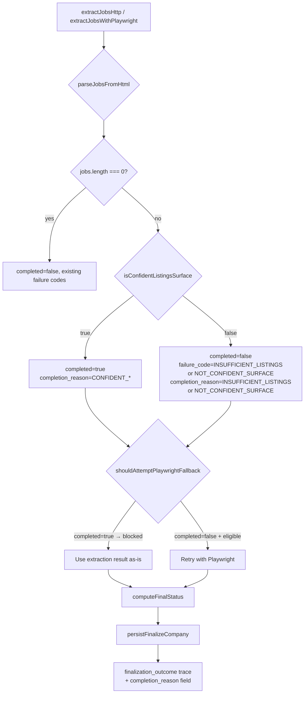
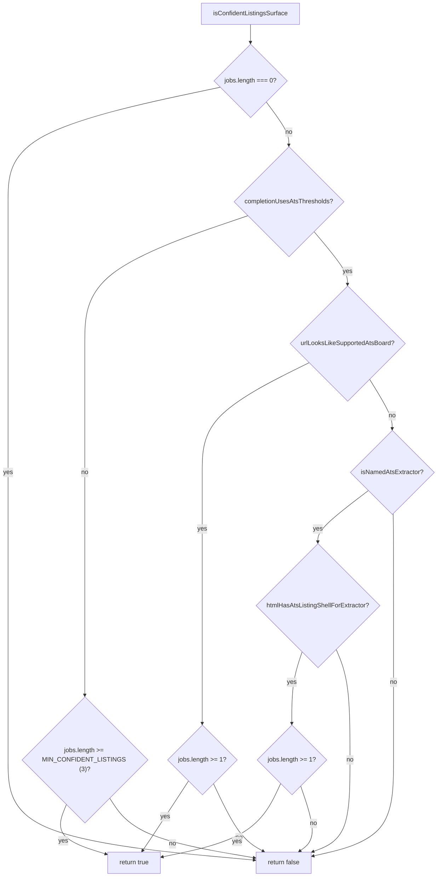

# Design Document: Extraction Completion

## Overview

This design tightens the extraction completion gate so `completed = true` requires confident enumeration evidence — not just a non-zero job count. The changes are scoped to three functions in `extraction.ts`, one gate in `processClaimedCompany.ts` (via `shouldAttemptPlaywrightFallback`), and one trace payload field in `finalizeCompany.ts`. No new modules, no new statuses, no API contract changes.

The core problem: `isConfidentListingsSurface` currently returns `true` on structural signals alone (ATS board URL, HTML shell presence) and uses a generic threshold of 2. This lets landing pages, partial pages, and navigation-only surfaces produce `completed = true`, which flows to `NO_MATCH_SCAN_COMPLETED` when the correct outcome is `UNVERIFIED`. Additionally, when the confidence check fails but jobs were parsed, the extraction result carries no failure details — a silent failure that degrades trace visibility. Finally, `shouldAttemptPlaywrightFallback` blocks on `jobs.length > 0`, preventing Playwright recovery when HTTP extraction produced a weak (non-confident) result.

### What changes

| Module | Function / Location | Change |
|--------|-------------------|--------|
| `extraction.ts` | `isConfidentListingsSurface` | Require meaningful enumeration for all paths; raise generic threshold 2→3 |
| `extraction.ts` | `extractJobsHttp` | Add `failure_code`/`failure_reason` when confidence check fails with jobs > 0 |
| `extraction.ts` | `extractJobsWithPlaywright` | Same weak-extraction failure detail addition |
| `extraction.ts` | module-level constant | Add `MIN_CONFIDENT_LISTINGS = 3` |
| `extraction.ts` | `shouldAttemptPlaywrightFallback` | Change `result.jobs.length > 0` gate to `result.completed` gate |
| `finalizeCompany.ts` | `persistFinalizeCompany` | Add `completion_reason` to `finalization_outcome` trace payload |
| `processClaimedCompany.ts` | `processClaimedCompany` | Compute `completion_reason` from extraction result and forward to finalization |

### What does NOT change

- Discovery classification (`verifyCareersCandidate`, `classifyListingsStrength`, `resolveListingsSurface`)
- Finalization ordering (`computeFinalStatus`, `assertFinalOutcomeRules`)
- API contracts (`RunDetailResponse`, `RunCompanyResponse`)
- Persisted statuses (no new user-facing statuses)
- ATS detection / platform detection
- Existing failure paths (`BLOCKED`, `CAP_REACHED`, `FETCH_FAILED`, `PLAYWRIGHT_FAILED`)

## Architecture

No new modules or architectural layers. All changes are surgical edits to existing functions within the current extraction → finalization pipeline.



### Decision flow: isConfidentListingsSurface (proposed)



Key difference from current: every path that returns `true` now requires `jobs.length >= 1` (ATS paths) or `jobs.length >= 3` (generic paths). Structural signals alone never suffice.

## Components and Interfaces

### 1. `MIN_CONFIDENT_LISTINGS` constant

**File:** `apps/api/src/lib/extraction.ts`
**Location:** Module-level, near existing constants

```typescript
/** Minimum parsed job listings for a generic surface to be considered confidently enumerated. */
export const MIN_CONFIDENT_LISTINGS = 3;
```

### 2. `isConfidentListingsSurface` (modified)

**File:** `apps/api/src/lib/extraction.ts`
**Current signature:** `(html: string, url: string, jobs: Job[], extractor_used: string) => boolean`
**New signature:** Same — no signature change.

**Return type change:** None. Still returns `boolean`.

**Behavioral changes:**
- ATS board URL path (`urlLooksLikeSupportedAtsBoard`): currently returns `true` unconditionally when `jobs.length > 0`. New: still returns `true` but only because `jobs.length > 0` is already gated at the top. The key fix is that the `jobs.length === 0` early return already handles the zero-jobs case. However, the current code returns `true` when `urlLooksLikeSupportedAtsBoard(url)` is true even with `jobs.length > 0` but where those jobs are just navigation links that slipped through. The real fix: require `jobs.length >= 1` explicitly in the ATS board path (already satisfied by the top guard, but making the enumeration requirement explicit in the code path).
- Named ATS extractor path (`isNamedAtsExtractor`): currently returns `htmlHasAtsListingShellForExtractor(html, extractor_used)` — shell presence alone = confident. New: returns `htmlHasAtsListingShellForExtractor(html, extractor_used) && jobs.length >= 1`. The shell must be present AND the extractor must have parsed at least one listing.
- Generic path: threshold changes from `jobs.length >= 2` to `jobs.length >= MIN_CONFIDENT_LISTINGS` (3).

**Proposed implementation:**

```typescript
export function isConfidentListingsSurface(
  html: string,
  url: string,
  jobs: Job[],
  extractor_used: string
): boolean {
  if (jobs.length === 0) {
    return false;
  }

  if (completionUsesAtsThresholds(extractor_used, url)) {
    if (urlLooksLikeSupportedAtsBoard(url)) {
      // ATS board URL + at least one parsed listing = confident.
      // jobs.length > 0 is guaranteed by the guard above.
      return true;
    }
    if (isNamedAtsExtractor(extractor_used)) {
      // Named ATS extractor: require BOTH structural evidence (HTML shell)
      // AND meaningful enumeration (at least one parsed listing).
      // Shell alone is not sufficient — the extractor must have found jobs.
      return htmlHasAtsListingShellForExtractor(html, extractor_used);
      // jobs.length > 0 is guaranteed by the guard above.
    }
    return false;
  }

  // Generic surface: require minimum threshold.
  return jobs.length >= MIN_CONFIDENT_LISTINGS;
}
```

**Note on the ATS board URL path:** The current code already has `jobs.length === 0 → false` at the top, so `urlLooksLikeSupportedAtsBoard` returning `true` already implies `jobs.length >= 1`. The behavioral change here is minimal for this path — the real fix is the named ATS extractor path (shell alone no longer suffices without the top guard having passed) and the generic threshold increase.

**Actual behavioral delta for named ATS extractors:** Currently, `htmlHasAtsListingShellForExtractor` returning `true` with `jobs.length === 0` would be caught by the top guard. But with `jobs.length === 1` (a single navigation link that slipped through the C4.2 filter), the shell check alone would still return `true`. This is acceptable because: (a) the C4.2 nav/CTA filter already strips most false positives, and (b) a named ATS extractor finding even one real listing on a page with a confirmed ATS shell is meaningful enumeration evidence. The threshold for ATS paths is intentionally lower than generic (1 vs 3) because the ATS structural signal provides additional confidence.

### 3. `extractJobsHttp` (modified)

**File:** `apps/api/src/lib/extraction.ts`
**Change:** After the confidence check, when `completed === false` and `jobs.length > 0`, populate `failure_code` and `failure_reason`.

**Current behavior (lines after confidence check):**
```typescript
const completed = isConfidentListingsSurface(html, url, jobs, extractor_used);
return { jobs, completed, listings_scanned, pages_visited };
```

**New behavior:**
```typescript
const completed = isConfidentListingsSurface(html, url, jobs, extractor_used);

if (!completed && jobs.length > 0) {
  const isGeneric = !completionUsesAtsThresholds(extractor_used, url);
  return {
    jobs,
    completed: false,
    listings_scanned,
    pages_visited,
    failure_code: isGeneric ? "INSUFFICIENT_LISTINGS" : "NOT_CONFIDENT_SURFACE",
    failure_reason: isGeneric
      ? `parsed ${jobs.length} listings, below minimum threshold of ${MIN_CONFIDENT_LISTINGS}`
      : "ATS extractor did not find confident enumeration evidence",
  };
}

return { jobs, completed, listings_scanned, pages_visited };
```

### 4. `extractJobsWithPlaywright` (modified)

**File:** `apps/api/src/lib/extraction.ts`
**Change:** Identical weak-extraction failure detail addition after the confidence check.

Same pattern as `extractJobsHttp` — after `isConfidentListingsSurface` returns `false` with `jobs.length > 0`, populate failure fields.

### 5. `shouldAttemptPlaywrightFallback` (modified)

**File:** `apps/api/src/lib/extraction.ts`
**Current gate:**
```typescript
if (result.jobs.length > 0) return false;
```

**New gate:**
```typescript
if (result.completed) return false;
```

This allows Playwright fallback when HTTP extraction found jobs but the confidence check failed (`completed = false`). The existing Condition A and Condition B logic below this gate remains unchanged.

**Impact on existing conditions:** Condition A and Condition B logic below the gate remains unchanged. The only change is the gate itself: `result.jobs.length > 0` → `result.completed`. This is the minimum change needed so weak non-zero extraction does not automatically block fallback. Condition A still requires `listings_scanned === 0` and Condition B still requires `PLAYWRIGHT_REQUIRED` from discovery — those eligibility rules are not modified.

### 6. `completion_reason` in finalization trace

**File:** `apps/api/src/lib/finalizeCompany.ts` → `persistFinalizeCompany`
**Change:** Add `completion_reason` field to the `finalization_outcome` trace payload JSON.

**File:** `apps/api/src/worker/processClaimedCompany.ts` → `processClaimedCompany`
**Change:** Compute `completion_reason` from the extraction result and forward it to `persistFinalizeCompany`.

**`FinalizePersistInput` type extension:**
```typescript
export type FinalizePersistInput = {
  // ... existing fields ...
  /** Deterministic reason for the extraction completion decision. */
  completion_reason: string;
};
```

**`completion_reason` values:**

The reason set is intentionally small and directly tied to the extraction decision:

| Value | When |
|-------|------|
| `CONFIDENT_SURFACE` | `completed=true` — extraction is confident regardless of path |
| `INSUFFICIENT_LISTINGS` | `completed=false`, generic surface below threshold |
| `NOT_CONFIDENT_SURFACE` | `completed=false`, ATS path failed confidence |
| `NO_LISTINGS_PARSED` | `completed=false`, zero jobs parsed |

When `completed=false` and an existing failure code is present (`BLOCKED`, `CAP_REACHED`, `FETCH_FAILED`, `PLAYWRIGHT_FAILED`, etc.), the `failure_code` already describes the reason. In those cases `completion_reason` is set to the existing `failure_code` value — no new taxonomy needed.

When extraction was never attempted (no listings URL resolved), the early-exit paths in `processClaimedCompany` already set `failure_code` on the finalization input. The `completion_reason` in those cases is derived the same way: use the existing `failure_code`.

**Computation in `processClaimedCompany`:**

The worker derives `completion_reason` from the extraction result without importing internal extraction helpers. The logic is simple because the extraction result already carries the necessary signals:

```typescript
function deriveCompletionReason(extraction: ExtractJobsResult): string {
  if (extraction.completed) {
    return "CONFIDENT_SURFACE";
  }
  // When completed=false, the failure_code already describes the reason.
  // For weak extraction: INSUFFICIENT_LISTINGS or NOT_CONFIDENT_SURFACE.
  // For existing failures: BLOCKED, CAP_REACHED, FETCH_FAILED, etc.
  if (extraction.failure_code) {
    return extraction.failure_code;
  }
  // Fallback — should not occur after this feature since weak extraction
  // always populates failure_code, but defensive.
  return extraction.jobs.length === 0 ? "NO_LISTINGS_PARSED" : "NOT_CONFIDENT_SURFACE";
}
```

This avoids exporting any internal extraction helpers. The extraction result's `failure_code` field already carries the specific reason (`INSUFFICIENT_LISTINGS`, `NOT_CONFIDENT_SURFACE`, `BLOCKED`, etc.), so the worker just forwards it.

**Trace payload addition in `persistFinalizeCompany`:**

```typescript
payload_json: JSON.stringify({
  computed_status,
  resolution_method,
  careers_url,
  listings_url,
  ats_type,
  extractor_used,
  listings_scanned,
  pages_visited,
  failure_code,
  failure_reason,
  match_count: matchedJobs.length,
  completion_reason,  // ← NEW
}),
```

## Data Models

### No schema changes

No database schema changes. The `completion_reason` is added only to the `finalization_outcome` trace event's `payload_json` (a free-form JSON string column). No new columns, no new tables.

### Type changes

**`ExtractJobsResult`** — no change. The `failure_code` and `failure_reason` optional fields already exist; they are now populated in more cases (weak extraction).

**`FinalizePersistInput`** — one new required field:
```typescript
completion_reason: string;
```

### No new exports from `extraction.ts`

No internal extraction helpers need to be exported. The `deriveCompletionReason` function in the worker operates solely on the `ExtractJobsResult` fields (`completed`, `failure_code`, `jobs.length`), which already carry the necessary signals after this feature populates `failure_code` for weak extraction.

### New constant

```typescript
export const MIN_CONFIDENT_LISTINGS = 3;
```


## Correctness Invariants

These are the key invariants this feature must uphold. They are validated by the unit tests described in the Testing Strategy section.

### Invariant 1: Completion implies confidence

If extraction returns `completed = true`, then `isConfidentListingsSurface` returned `true` for the same inputs. If `isConfidentListingsSurface` returns `false`, then `completed` must be `false`.

### Invariant 2: Incomplete extraction produces UNVERIFIED

When `extraction.completed = false` and a careers URL is present, `computeFinalStatus` must return `UNVERIFIED`.

### Invariant 3: Confidence requires enumeration above applicable threshold

If `isConfidentListingsSurface` returns `true`, then `jobs.length >= 1` always. For generic surfaces, `jobs.length >= MIN_CONFIDENT_LISTINGS` (3).

### Invariant 4: Weak extraction carries failure details

When `jobs.length > 0` and `completed = false`, the extraction result must have non-null `failure_code` and `failure_reason`.

### Invariant 5: Playwright fallback gates on completion, not job count

When `completed = true`, `shouldAttemptPlaywrightFallback` returns `false`. When `completed = false` with `jobs.length > 0`, the function is not blocked by job count alone.

## Error Handling

No new error handling patterns are introduced. The changes extend existing patterns:

1. **Weak extraction failure details** — The existing `failure_code` / `failure_reason` fields on `ExtractJobsResult` are already used by `BLOCKED`, `CAP_REACHED`, `FETCH_FAILED`, `PLAYWRIGHT_FAILED`, `NO_LISTINGS_PARSED`, and `HTTP_NO_LISTINGS`. This feature adds two new failure code values (`INSUFFICIENT_LISTINGS`, `NOT_CONFIDENT_SURFACE`) using the same mechanism. These flow through `computeFinalStatus` unchanged — the existing `extraction.failure_code ?? "EXTRACTION_INCOMPLETE"` fallback in `computeFinalStatus` handles them correctly, but now the specific codes will be used instead of the fallback.

2. **Existing failure paths preserved** — `BLOCKED`, `CAP_REACHED`, `FETCH_FAILED`, `PLAYWRIGHT_FAILED` paths are not modified. They continue to return `completed = false` with their existing failure codes before the confidence check is reached.

3. **Defense-in-depth unchanged** — `assertFinalOutcomeRules` in `finalizeCompany.ts` and the `isExtractionContextTrustworthy` guard in `processClaimedCompany.ts` remain unchanged. The tighter confidence check reduces the cases where these guards need to fire, but they remain as safety nets.

4. **No new exceptions** — No new `throw` statements. The `assertFinalOutcomeRules` function already throws on invariant violations; this feature reduces the likelihood of those violations by tightening the upstream gate.

## Testing Strategy

### Test file

New test file: `apps/api/src/lib/__tests__/extraction-completion.test.ts`

### Testing framework

Vitest unit tests only (already configured in `apps/api/vitest.config.ts`). No property-based testing framework needed.

### Test plan

Focused unit tests covering the key completion and fallback cases:

**`isConfidentListingsSurface` tests:**
- 0 jobs returns `false` for every extractor type
- 1 job on generic surface returns `false` (below threshold)
- 2 jobs on generic surface returns `false` (below threshold)
- 3 jobs on generic surface returns `true` (meets threshold)
- ATS board URL + 1 job returns `true`
- Named ATS extractor + shell HTML + 1 job returns `true`
- Named ATS extractor + no shell HTML + 5 jobs returns `false` (no structural evidence)
- Named ATS extractor name alone (no shell, no board URL) does not imply completion

**Weak extraction failure details:**
- Generic surface with 1–2 jobs returns `failure_code: "INSUFFICIENT_LISTINGS"` and non-null `failure_reason`
- ATS surface with jobs but no confidence returns `failure_code: "NOT_CONFIDENT_SURFACE"` and non-null `failure_reason`
- Weak extraction still includes `listings_scanned` equal to `jobs.length`

**`shouldAttemptPlaywrightFallback` tests:**
- `completed=true` returns `false` (fallback blocked)
- `completed=false` with `jobs.length > 0` does not block on job count alone
- Existing conditions (Condition A, Condition B) still apply after the gate change

**Regression tests:**
- Existing failure paths (`BLOCKED`, `CAP_REACHED`, `FETCH_FAILED`, `PLAYWRIGHT_FAILED`) still produce `completed: false` with their existing failure codes
- `computeFinalStatus` with `completed=false` still produces `UNVERIFIED`
- `computeFinalStatus` with `completed=true` and `matchCount=0` still produces `NO_MATCH_SCAN_COMPLETED`

**`deriveCompletionReason` tests:**
- `completed=true` → `"CONFIDENT_SURFACE"`
- `completed=false` with `failure_code` → returns the `failure_code` value
- `completed=false`, no `failure_code`, `jobs.length=0` → `"NO_LISTINGS_PARSED"`
- `completed=false`, no `failure_code`, `jobs.length>0` → `"NOT_CONFIDENT_SURFACE"`
